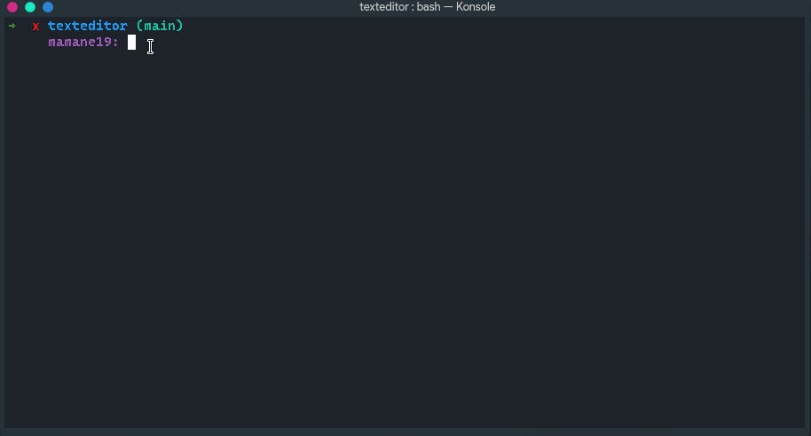

<h1 align="center">Text Editor Using Python</h1>

<p align="center">This program is a simple Text Editor. It uses  Tkinter packages to have a small GUI (Graphical User Interface) to write, edit, and save files (.txt). However you can save as .py or other type of files but, you can not edit them in the text editor as pyhton files or other type of files. Once you save the file you will see in your IDE that it is actually a python but by default it is a .txt file. (We will be working on this feature in the future). For now let's just have .txt files :) 
We also used a stack data structure for the undo and redo purposes. 
</p>


---
## Demo



## Getting Started
The program is structured using the [module architecture](https://www.tutorialspoint.com/python/python_modules.htm#:~:text=A%20module%20allows%20you%20to,file%20consisting%20of%20Python%20code) to make the code readabiliy very easy.

### Third party libraries:
- [tkinter](https://pypi.org/project/tkintertable/)

```
$pip install tkintertable
```
</br>
---

We recommend you to use a virtual environment to install those packages for you to not get your computer overwhelmed in terms of space. you can visit this [website](https://docs.python.org/3/library/venv.html) if you would like to do so. Note that it would not be a problem to run the program if you did not use a virtual environment.


To execute the program, run the entry-point file using the command inside the project directory:

```
$cd main 
$python textEditor.py
```
If you have multiple versions of python in your system, use the command bellow:
```
$python3 textEditor.py
```
# Future Updates
<p>Below are data structure and algorithms we will be adding to the text editor; </p>

- <h3>Two Stacks</h3> The idea behind this data structure is to mimic editing lines rather than a vast document. The two stacks are used to represent the contents where the cursor is. One stack will represent all the contents left of the cursor, while the other stack will represent all the contents right of the cursor.
- <h3>Queues</h3> For copying and pasting texts, Queues are used where you can enqueue or dequeue from the same end. You are just changing the name of push and pop operations of a stack and telling it to Dequeue(for paste command) and Enqueue(for copy command). With every request for a copy and paste, a system call is made along with Enqueue and Dequeue’s individual needs.
- <h3>Hashing</h3> To help us keep track of the words and display the number of words while the user is typing.
- <h3>Checksum/Hashes Algo</h3> To help get the integrity of the data that is being saved.


